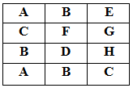
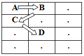

Đây là bài đầu tiên trong chuỗi bài ôn luyện thuật toán trên trang [spoj.com](http://spoj.com) mà Phạm Văn Lâm đã làm. Và sau đây là đề bài mà tôi đã dịch từ tiếng anh sang tiếng việt. Vì tôi chủ yếu là tự học tiếng anh, nên có thể dịch nghĩa chưa được chuẩn xác lắm. Mong các bạn thông cảm.

## Đề bài:

Cho một lưới hai chiều gồm các kí tự. Yêu cầu tìm ra đường đi dài nhất của các kí tự liên tiếp, bắt đầu tại 'A'. Đường đi có thể nhảy từ 1 kí tự trên lưới đến một kí tự khác theo chiều ngang, dọc hay chéo. 

**Ví dụ**: ở hình sau đây, có một vài đường đi từ A  đến D, nhưng không có đường nào đi từ A đến E: 

 

Một trong các đường đi từ A đến D là: 

### Đầu vào:

Mỗi test case sẽ bắt đầu với một dòng gồm 2 số nguyên H, W lần lượt là chiều cao, và chiều rộng của lưới, với 1 <= H, W <= 50\. Tiếp theo đó là H dòng, mỗi dòng sẽ có W kí tự viết in hoa. Đầu vào kết thúc với H = W = 0.

### **Đầu ra:**

Với mỗi test case in ra "Case C: x" (không có dấu ngoặc kép). Trong đó, C là số thứ tự của test case bắt đầu từ 1 và x là độ dài đường đi dài nhất tìm được.

### **Ví dụ:**

**Đầu vào:** 

4 3 

ABE 

CFG 

BDH 

ABC 

0 0 

**Đầu ra:** 

Case 1: 4 

_Các bạn có thể tham khảo link gốc đề bài và submit code tại đây: [http://www.spoj.com/problems/ABCPATH/](http://www.spoj.com/problems/ABCPATH/)_

### **Phân tích:**

- Thực ra đây là bài toán tìm đường đi. Ta sẽ tìm tất cả các kí tự 'A' trên lưới, sau đó tìm đường đi từ vị trí đó thoả mãn yêu cầu bài toán - Một chú ý ở đây đó là: nếu chúng ta tìm tất cả đường đi có thể thì khả năng cao sẽ dẫn đến time limit. Các bạn có thể thấy bài toán này có đặc điểm là: khi có 2 đường mà trong quá trình đi của nó cùng đi qua một điểm, thì thực chất 2 đường đó sẽ có độ dài như nhau. Ví dụ có 2 đường cùng đi đến điểm C, thì nghĩa là trước đó cả hai đều phải đi qua điểm A và B. => Vì vậy, với bài toán này ta sẽ sử dụng thuật toán [tìm kiếm theo chiều sâu - DFS](/category/tim-kiem-theo-chieu-sau-dfs/).

## **Lời giải:**

(Các bạn nên tự mình nghĩ ra thuật toán của bài toán trước khi tham khảo code của tôi nhé. Hãy phát huy tối đa khả năng sáng tạo của bản thân. Hơn nữa code tôi viết ra cũng chưa thật sự tối ưu. Nên rất mong nhận được sự chia sẻ của các bạn.)

### **Code C/C++:**

`gist:completejavascript/ae79cfac0652cf5b6c8d253adb0909e3`

_Code by Phạm Văn Lâm_