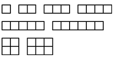

## Đề bài:

Thái có N hình vuông với kích thước 1\. Hỏi có bao nhiêu dạng hình chữ nhật mà Thái có thể tạo ra từ những hình vuông này? 

Biết rằng, 2 hình chữ nhật được xem là khác nhau nếu chúng không thể quay hay dịch chuyển để trở thành hình còn lại. Trong quá trình xây dựng lên hình chữ nhật, Thái không thể làm thay đổi hình dạng của các hình vuông và cũng không thể đặt chúng lên trên những hình còn lại.

### **Đầu vào:**

Gồm chỉ một dòng chứa một số nguyên N, với 1 <= N <= 10000.

### **Đầu ra:**

In ra chỉ một dòng chứa một số nguyên là những hình chữ nhật mà Thái có thể tạo ra.

### **Ví dụ:**

**Đầu vào:** 

6 

**Đầu ra:** 

8 

**Giải thích:** 

Với N = 6 hình vuông, ta có thể tạo ra hình chữ nhật bằng cách lần lượt xét các hình chữ nhật với chiều cao bằng 1 hoặc 2\. Như hình dưới đây. 

Do đó, kết quả là 8 hình chữ nhật. 

Tác giả: Jakub Radoszewski 

_Các bạn có thể tham khảo đề bài tiếng anh và submit code tại: [http://www.spoj.com/problems/AE00/](http://www.spoj.com/problems/AE00/)_

### **Phân tích:**

+ Đối với bài này, đầu vào N có giá trị tối đa là 10000\. Do đó nếu sử dụng thuật toán vét cạn thì chắc chắn sẽ bị time limit. Ở đây tôi sẽ dùng thuật toán [tham lam - Greedy](/category/tham-lam-greedy/) để giải quyết bài toán. 

+ Ta sẽ lần lượt xét từng loại hình chữ nhật với chiều cao là 1, 2, 3,…Với mỗi lại ta sẽ suy ra được số hình chữ nhật với chiều cao như vậy. Trong ví dụ trên, N = 6 hình vuông: 

– Với hình chữ nhật chiều cao h = 1: Ta có chiều rộng tối đa tương ứng là: N / h = 6 / 1 = 6. Nghĩa là ta sẽ có thể tạo ra được 6 hình chữ nhật kích thước là: 1×1, 1×2, 1×3, 1×4, 1×5, 1×6 – Với hình chữ nhật có chiều cao h = 2: Chiều rộng tối đa là: 6 / 2 = 3\. Nghĩa là ta có thể tạo ra 3 hình chữ nhật có kích thước là: 2×1, 2×2, 2×3\. Tuy nhiên, các bạn có thể thấy rằng hình chữ nhật 2×1 và 1×2 là một. Do đó, để không bị trùng lặp, tôi đưa vào thêm một điều kiện là hình chữ nhật tạo ra phải có chiều rộng không nhỏ hơn chiều cao. Tức là trong trường hợp này, tôi chỉ lựa chọn 2 hình chữ nhật là 2×2 và 2×3 

+ Như vậy, kết quả sẽ là 6 + 2 = 8 hình chữ nhật.

## **Lời giải:**

(Các bạn nên tự mình suy nghĩ thuật toán và lập trình trước khi tham khảo code của tôi nhé. Hãy phát huy tối đa khả năng sáng tạo của bản thân. Hơn nữa code tôi viết ra cũng chưa thật sự tối ưu. Nên rất mong nhận được sự chia sẻ của các bạn.)

### **Code C/C++:**

`gist:completejavascript/77fbee0e92e01d06360854e810916deb`

_Code by Phạm Văn Lâm_