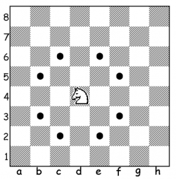

## **Đề bài:**

Tít và Mít là đôi bạn tốt. Tuy nhiên, gần đây họ có cãi cọ nhau trong khi chơi cờ vua. Mít muốn biết số bước đi nhỏ nhất để quân mã xuất phát từ 1 ô để đi đến 1 ô khác trên bàn cờ vua 8×8\. Tít rất thông minh nên cậu ta đã nghĩ ra thuật toán và viết ra một chương trình để giải quyết bài toán này. Tít đố Mít có thể làm được như vậy. Tuy nhiên, Mít rất yếu về lập trình nên mong muốn bạn giúp cậu ấy. Quân mã di chuyển theo hình chữ L, chắc các bạn cũng biết nên tôi không giải thích nhiều nữa. Quân mã phải di chuyển theo cách trên và không được đi ra khỏi bàn cờ. Hình sau minh hoạ bàn cờ, và cách di chuyển của con mã: 

### **Đầu vào:**

Có tổng số T test cases. Với mỗi test case, sẽ gồm 2 thành phần. Thành phần thứ nhất là điểm xuất phát của con mã. Và thành phần thứ hai là đích đến của con mã. Mỗi thành phần bao gồm 2 kí tự. Kí tự thứ nhất thuộc 8 kí tự từ ‘a’ đến ‘h’. Kí tự thứ hai thuộc 8 kí tự từ ‘1’ đến ‘8’.

### **Đầu ra:**

In ra số bước tối thiểu mà quân mã cần để đi từ điểm xuất phát đến đích ở các dòng riêng biệt. 

**Ràng buộc:** 1 <= T <= 4096

### **Ví dụ:**

**Đầu vào:** 

3 

a1 h8 

a1 c2 

h8 c3 

**Đầu ra:** 

6 

1 

4 

_Các bạn có thể tham khảo đề bài tiếng anh và submit code tại: [http://www.spoj.com/problems/NAKANJ/](http://www.spoj.com/problems/NAKANJ/)_

### **Phân tích:**

+ Đây là bài toán tìm đường đi ngắn nhất từ một điểm tới một điểm khác. + Do đó ta sẽ triển khai thuật toán [tìm kiếm theo chiều rộng - BFS](/category/tim-kiem-theo-chieu-rong-bfs/) từ điểm ban đầu. Và lan sang các điểm kề với nó theo 8 hướng mà con mã có thể đi.

## **Lời giải:**

(Các bạn nên tự mình nghĩ ra thuật toán của bài toán trước khi tham khảo code của tôi nhé. Hãy phát huy tối đa khả năng sáng tạo của bản thân. Hơn nữa code tôi viết ra cũng chưa thật sự tối ưu. Nên rất mong nhận được sự chia sẻ của các bạn.)

### **Code C/C++:**

`gist:completejavascript/bb9b5d9cf213b22dea320d362d098f08`

_Code by Phạm Văn Lâm_