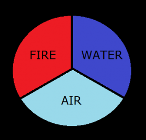

## Đề bài:

Trò chơi vô cùng đơn giản. Ban đầu bạn được cho 'H' lượng máu và 'A' lượng giáp. Tại mỗi thời điểm bất kỳ bạn có thể đứng ở 3 nơi - lửa, nước và không khí. Sau mỗi đơn vị thời gian, bạn phải di chuyển vị trí để có thể sống sót. Ví dụ, nếu bạn đang đứng ở lửa thì bạn có thể bạn có thể di chuyển sang nước hoặc không khí. 

Nếu như bạn nhảy vào **không khí**, bạn sẽ được **tăng 3 máu** và **tăng 2 giáp**. Nếu bạn nhảy vào **nước**, bạn sẽ bị **giảm 5 máu** và **10 giáp**. Nếu như bạn nhảy vào lửa, bạn sẽ bị **giảm 20 máu** và **tăng 5 giáp. **Nếu máu hoặc giáp của bạn <= 0 thì bạn sẽ chết ngay lập tức. 

Hãy tìm thời gian tối đa bạn có thể sống.

### **Đầu vào:**

Dòng đầu tiên của đầu vào là số lượng testcase t. Mỗi testcase sẽ bao gồm 2 số H và A lần lượt là số máu và số giáp ban đầu.

### **Đầu ra:**

Vói mỗi testcase, in ra thời gian tối đa bạn có thể sống. 

**Chú ý:** bạn có thể chọn 1 trong 3 vị trí cho di chuyển đầu tiên.

### Ràng buộc:

1 <= t <= 10 

1 <= H, A <= 1000

### **Ví dụ:**

**Đầu vào:** 

3 

2 10 

4 4 

20 8 

**Đầu ra:** 

1 

1 

5 

_Các bạn có thể tham khảo link gốc đề bài và submit code tại đây:[http://www.spoj.com/problems/DIEHARD/](http://www.spoj.com/problems/DIEHARD/)_

### Phân tích

+ Theo đầu bài, ta có thể chọn 1 trong 3 vị trí cho lần di chuyển đầu tiên. Mà bạn có thể thấy rằng nếu nhảy vào không khí thì cả máu và giáp đều tăng. Do đó, tôi chọn đứng ở không khí đầu tiên. 

+ Vì chỉ có 3 vị trí nước, không khí và lửa nên khi bạn ở một vị trí bất kỳ thì có thể nhảy sang vị trí còn lại. Mà khi nhảy vào không khí, cả máu và giáp đều tăng. Do đó, nếu bạn nhảy theo thứ tự sau đây sẽ có lợi nhất: **Không khí - nước - không khí** hoặc **Không khí - lửa - không khí.** 

+ Ở bài toán này, tôi sẽ triển khai cách giải bằng đệ quy, sử dụng [thuật toán quy hoạch động - Dynamic programming](/category/quy-hoach-dong-dynamic-programming/) để lưu lại kết quả thời gian sống lớn nhất ứng với giá trị 'H' máu và 'A' giáp ban đầu.

## Lời giải

(Các bạn nên tự mình nghĩ ra thuật toán của bài toán trước khi tham khảo code của tôi nhé. Hãy phát huy tối đa khả năng sáng tạo của bản thân. Hơn nữa code tôi viết ra cũng chưa thật sự tối ưu.  Nên rất mong nhận được sự chia sẻ của các bạn.)

### Code C/C++:

`gist:completejavascript/7d246afe0913e0d637bb2e822cacc34e`

_Code by Phạm Văn Lâm._