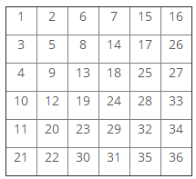

## Đề bài:

Một ma trận kích thước NxN được điền đầy bởi các con số từ 1 đến N<sup>2</sup> theo đường chéo zig-zag. Bảng sau đây mô tả những con số trong ma trận kích thước N = 6. 

 

Có một con thỏ ở vị trí số 1\. Nó có thể nhảy sang ô hàng xóm kề với ô nó đang đứng theo 4 hướng (trên, dưới, trái, phải) nếu ô đó tồn tại. 

Cho K chữ cái biểu diễn cách nhảy của con thỏ. Hãy viết chương trình tính tổng các số của tất cả các ô mà con thỏ nhảy tới. Biết con thỏ không bao giờ nhảy ra khỏi ma trận.

### Đầu vào:

Dòng đầu tiên bao gồm 2 số nguyên N và K (1 <= N <= 100000, 1 <= K <= 300000), lần lượt là kích thước ma trận và số bước nhảy của con thỏ. 

Dòng tiếp theo là 1 dãy bao gồm K kí tự 'U', 'D', 'L' và 'R', miêu tả cách nhảy của con thỏ. Trong đó, 'U', 'D', 'L','R' lần lượt là nhảy lên (UP), nhảy xuống (DOWN), nhảy sang trái (LEFT) và nhảy sang phải (RIGHT). Và con thỏ sẽ không nhảy ra khỏi ma trận.

### Đầu ra:

Bao gồm 1 dòng chứa 1 số nguyên là tổng của tất cả những ô mà con nhỏ nhảy tới. 

**Chú ý**: Các số không phải luôn thỏa mãn là số nguyên 32 bit.

### **Ví dụ:**

**1) Đầu vào:** 

```
6 8 
DDRRUULL
``` 

**Đầu ra:** 

47 

Giải thích: con thỏ nhảy như sau: 1, 3, 4, 9, 13, 8, 6, 2, 1 

**2) Đầu vào:** 

```
3 8 
DDRRUULL
```

**Đầu ra:**

41 

Giải thích: con thỏ nhảy như sau: 1, 3, 4, 8, 9, 7, 6, 2, 1 

**3) Đầu vào:**

```
6 10 
RRRRRDDDDD
``` 

**Đầu ra:** 

203 

Giải thích: con thỏ nhảy như sau: 1, 2, 6, 7, 15, 16, 26, 27, 33, 34, 36 

_Các bạn có thể tham khảo link gốc đề bài và submit code tại đây: [http://www.spoj.com/problems/ZIGZAG/](http://www.spoj.com/problems/ZIGZAG/)_

### Phân tích:

  * Tôi sẽ sử dụng [thuật toán tham lam - Greedy](/category/tham-lam-greedy/) để giải bài toán này. 
  
  * Ở đây tôi sẽ không sử dụng một mảng để lưu thông tin của ma trận. Vì việc tạo ra ma trận này là rất mất thời gian. Nếu các bạn để ý thì các bạn sẽ nhận ra được quy luật. Qua đó, từ tọa độ hàng, cột tôi có thể suy ra giá trị của ô đó là bao nhiêu. 
  
  * Với ma trận kích thước N thì sẽ có 2\*N-1 đường chéo (có dạng '/'). Mỗi đường chéo sẽ bao gồm các ô mà tổng giá trị hàng và cột của chúng là như nhau và tôi đặt là chỉ số của đường chéo. Ví dụ: đường chéo 0 chỉ bao gồm 1 phần tử ```[0][0]```; đường chéo 1 bao gồm 2 ô là ```[0][1]``` và ```[1][0]```; đường chéo 2 bao gồm 3 ô là : ```[0][2]```, ```[1][1]``` và ```[2][0]```,,.. cho đến đường chéo 2\*N-2 bao gồm 1 ô là ```[N-1][N-1]```. 
  
  * Sử dụng quy nạp tôi chứng minh được công thức tính số nhỏ nhất của 1 đường chéo như sau: 
  
    * Với i là chỉ số đường chéo (i = 0, 1, 2,...,2\*N-2), k là số nhỏ nhất của 1 đường chéo. 
    * Nếu i < N thì  k = (1 + (i\*(i+1))/2); 
    * Ngược lại, k =  (((3\*N - i)\*(i - N + 1))/2 + remember) 
    * Trong đó, remember là số nhỏ nhất của đường chéo ở giữa (chỉ số N - 1) 
  
  * Rõ ràng, khi tôi đã biết chỉ số hàng, cột của một điểm và số nhỏ nhất của đường chéo mà điểm đó thuộc vào thì tôi hoàn toàn có thể tính được giá trị của điểm đó (cụ thể tôi sẽ trình bày ở trong code phía dưới.)

## Lời giải:

(Các bạn nên tự mình nghĩ ra thuật toán của bài toán trước khi tham khảo code của tôi nhé. Hãy phát huy tối đa khả năng sáng tạo của bản thân. Hơn nữa code tôi viết ra cũng chưa thật sự tối ưu.  Nên rất mong nhận được sự chia sẻ của các bạn.)

### Code C/C++:

`gist:completejavascript/64209abd6d4a6290a03cb6c5b307afa7`

_Code by Phạm Văn Lâm._