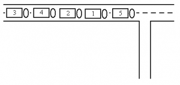
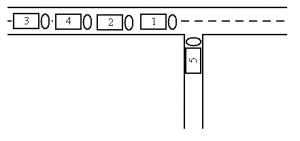
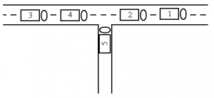
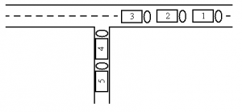
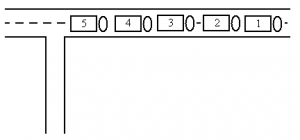

## Đề bài:

Để đảm bảo rằng chiếc xe diễu hành sẽ hoạt động trở lại vào mùa hè, mỗi năm ban tổ chức quyết định một thứ tự xác định trước cho việc trang trí những chiếc xe. Kinh nghiệm dạy họ rằng nên giữ một cạnh trống để có thể đưa những chiếc xe vào theo đúng thứ tự. 

Đường bên cạnh là rất nhỏ. Vì vậy, 2 chiếc xe không thể cùng vượt qua. Do đó, những chiếc xe nào vào sau sẽ phải ra trước. Bởi vì các xe đi rất gần nhau nên chúng không thể quay đầu hay vào trở lại. Bạn được cho thứ tự đến của những chiếc xe. Viết chương trình kiểm tra xem các chiếc xe có thể đi vào theo đúng thứ tự mà ban tổ chức quyết định hay không.

### Đầu vào:

Có nhiều test case. Dòng đầu tiên của mỗi test case là một số n, số lượng của những chiếc xe. Dòng thứ 2 chứa các số từ 1 đến n, sắp xếp theo tứ tự ngẫu nhiên. Tất cả các chữ số được phân cách bởi dấu cách. Những số này biểu diễn thứ tự, mà những chiếc xe đi đến con đường. Số xe là không lớn hơn 1000\. Kết thúc của đầu vào là số 0.

### Đầu ra:

Với mỗi test case , in ra 1 dòng duy nhất là "yes" nếu như thoả mãn, ngược lại thì in ra là "no".

### Ví dụ:

**Đầu vào:**

```
5
5 1 2 4 3 
0
```

**Đầu ra:**

yes

**Giải thích:** 

Ban đầu: 

 

Xe có thể thay đổi như sau: 

 

 

 

 

Quá trình kết thúc. 

_Các bạn có thể tham khảo link gốc đề bài và submit code tại đây: [http://www.spoj.com/problems/STPAR/](http://www.spoj.com/problems/STPAR/)_

### Phân tích:

+ Ở đây, tôi sẽ dùng ngăn xếp stack để giải quyết bài toán. Bài toán này có thể xếp vào dạng sử dụng [thuật toán tham lam Greedy.]/category/tham-lam-greedy/)

## Lời giải:

(Các bạn nên tự mình nghĩ ra thuật toán của bài toán trước khi tham khảo code của tôi nhé. Hãy phát huy tối đa khả năng sáng tạo của bản thân. Hơn nữa code tôi viết ra cũng chưa thật sự tối ưu.  Nên rất mong nhận được sự chia sẻ của các bạn.)

### Code C/C++:

`gist:completejavascript/ef6aa3d64ae0b5d3eef91ac18b8c4df1`

### Code Python:

`gist:completejavascript/3682161f4460e6814c076a73998a601a`

_Code by Phạm Văn Lâm._