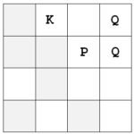

## Đề bài:

Tất cả các bạn có thể đã quen thuộc với bài toán nổi tiếng 8 con hậu - bài toán yêu cầu bạn đặt 8 con hậu trên một bàn cờ sao cho không có 2 con nào có thể tấn công được nhau. Ở bài toán này, bạn được cho vị trí của quân hậu (Q), quân mã (K) và quân tốt (P) và yêu cầu bạn tìm ra xem có bao nhiêu ô trống mà không bị tấn công bởi con con mã hoặc con hậu hoặc cả hai. Chúng ta sẽ gọi những ô này là ô an toàn (safe). Ở đây, quân tốt được xem như là các vật cản mà không có khả năng tấn công. Bảng sau có 6 ô an toàn (là các ô tô đậm hơn) 

[](SPOJ.COM-thuat-toan-bai-QKP-Queens-Knights-and-Pawns-pic-thuattoan-phamvanlam-com.png) 

Nhắc lại rằng, con mã chỉ có thể di chuyển tới bất kì một ô rảnh nào mà nó ở góc đối diện của hình chữ nhât kích thước 2x3\. Con hậu có thể di chuyển theo 8 hướng. Chú ý rằng, con hậu có thể bị chặn bởi các con khác, trong khi con mã thì sẽ không bị chặn bởi con khác.

### Đầu vào:

Bao gồm nhiều test case. Mỗi test case sẽ bao gồm 4 dòng. Dòng đầu tiên bao gồm 2 số nguyên n, m - biểu diễn kích thước của bàn cờ, tương ứng với số hàng và số cột, n, m không quá 1000\. 3 dòng tiếp theo sẽ có dạng như sau: 

_k r<sub>1</sub> c<sub>1</sub> r<sub>2</sub> c<sub>2</sub> · · · r<sub>k</sub> c<sub>k</sub>_ 

xác định số lượng và vị trí của các con hậu, mã, và tốt. Chỉ số hàng, cột sẽ bắt đầu từ 1\. Mỗi loại sẽ có tối đa 100 con. Giá trị n=m=0 xác định kết thúc đầu vào.

### Đầu ra:

Mỗi test case sẽ in ra dạng : _Board b has s safe squares._ Trong đó, b là chỉ số của bàn cờ, bắt đầu từ 1 và s là số ô an toàn tương ứng.

### Ví dụ:

**Đầu vào:**

```
4 4
2 1 4 2 4
1 1 2
1 2 3
2 3
1 1 2
1 1 1
0
1000 1000
1 3 3
0
0
0 0
```

**Đầu ra:**

```
Board 1 has 6 safe squares.
Board 2 has 0 safe squares.
Board 3 has 996998 safe squares.
```

_Các bạn có thể tham khảo link gốc đề bài và submit code tại đây: [http://www.spoj.com/problems/QKP/](http://www.spoj.com/problems/QKP/)_

### Phân tích:

Ở đây tôi sẽ sử dụng [thuật toán tham lam Greedy](/category/tham-lam-greedy/) để giải bài toán. + Với mỗi con mã, tôi sẽ duyệt 8 hướng và đếm vị trí mỗi con mã có thể ăn. Sau khi tính xong thì tôi sẽ đánh dấu rằng vị trí đó đã được ăn để không bị trùng lặp cho lần sau. + Sau khi duyệt xong hết con mã sẽ đến con hậu.

## Lời giải:

(Các bạn nên tự mình nghĩ ra thuật toán của bài toán trước khi tham khảo code của tôi nhé. Hãy phát huy tối đa khả năng sáng tạo của bản thân. Hơn nữa code tôi viết ra cũng chưa thật sự tối ưu. Nên rất mong nhận được sự chia sẻ của các bạn.)

### Code C/C++:

`gist:completejavascript/bad21807b218396a97a5f5db1b592fb9`

Code by Phạm Văn Lâm.