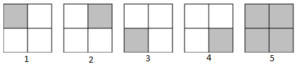

## Đề bài:

Richard Phillips Feynman được biết đến như là một nhà vật lý và một người được nhận giải Nobel về vật lý. Ông làm việc trong ngành lý thuyết vật lý và tiên phong trong việc tính toán trường của lượng tử. Ông đã đến thăm Nam Mĩ được khoảng 10 tháng, giảng dạy và tận hưởng cuộc sống ở vùng chí tuyến này. Ông cũng được biết đến cho cuốn sách của mình "Surely You're Joking, Mr. Feynman!" và "What Do You Care What Other People Think?", bao gồm những cuộc phiêu lưu của ông ở vùng dưới xích đạo này. 

Đam mê trong cuộc sống của ông là giải quyết và tạo ra những câu đố. Gần đây, một nông dân ở vùng Nam Mĩ, người là một ông chủ cho đến một nhà Vật lý năm 1949, đã tìm thấy một vài tờ giấy và những cuốn sổ ghi chú, cái được tin rằng là thuộc về Feynman. Ở giữa cuốn sổ, phần về vật lý Mezon và điện tử học, có một tờ giấy, ở đó Feynman đã ghi ra một câu đố đơn giản. Đó là: có bao nhiêu hình vuông khác nhau ở một cái lưới kích thước NxN. 

Ở tờ giấy đó, có một hình vẽ, được chép lại như dưới đây, cho thấy với N = 2 thì đáp án là 5 hình vuông khác nhau. 

[](SPOJ.COM-thuat-toan-bai-SAMER08F-Feynman-pic-thuattoan-phamvanlam-com-300x68.png)

### Đầu vào:

Bao gồm nhiều test case. Mỗi test case là 1 dòng, chứa số N, biểu diễn số hình vuông ở mỗi cạnh, (1 ≤ _N_ ≤ 100). Kết thúc của đầu vào là số 0.

### Đầu ra:

Với mỗi test case, in ra một dòng chứa số lượng hình vuông khác nhau tương ứng với mỗi test case.

### Ví dụ

**Đầu vào:**

```
2
1
8
0
```

**Đầu ra:**

```
5
1
204
```

_Các bạn có thể tham khảo link gốc đề bài và submit code tại đây: [ http://www.spoj.com/problems/SAMER08F/](http://www.spoj.com/problems/SAMER08F/)_

### Phân tích:

  * Có thể sẽ có nhiều cách giải bài toán này. Ở đây tôi đơn giản sử dụng [thuật toán tham lam Greedy](/category/tham-lam-greedy/) để giải quyết bài toán. 
  
  * Yêu cầu của bài toán là tìm ra số hình vuông khác nhau ở trên lưới NxN. Dễ thấy rằng, kết quả sẽ là tổng số hình vuông có kích thước cạnh 1, cạnh 2, cạnh 3,... cạnh N. 
  
  * Để đếm được hết tất cả các hình vuông mà không bị lặp, tôi sẽ duyệt tất cả các ô trong lưới theo chiều từ trái sang phải, từ trên xuống dưới. Tại mỗi ô tôi sẽ đếm số hình vuông có điểm bắt đầu là tại ô đó. 
  
  * Trong ví dụ trên với N = 2:
    * Trước tiên tôi xét điểm (0,0): khi đó tôi có 2 hình vuông bắt đầu tại điểm này là: hình 1 và hình 5
    * Tiếp theo là điểm (0, 1): chỉ có 1 hình là hình 2
    * Xét điểm (1, 0): có 1 hình là hình 3
    * Xét điểm (0, 1): có 1 hình là hình 4. 
    
    Như vậy, tổng là 5 hình.
  
  * Qua phân tích, tôi suy ra một công thức đó là: tại điểm (row, col), số hình vuông có điểm bắt đầu tại đó là: N - Max(row, col). Các bạn có thể thử lại nếu như còn thấy nghi ngờ về công thức này.

## Lời giải:

(Các bạn nên tự mình nghĩ ra thuật toán của bài toán trước khi tham khảo code của tôi nhé. Hãy phát huy tối đa khả năng sáng tạo của bản thân. Hơn nữa code tôi viết ra cũng chưa thật sự tối ưu. Nên rất mong nhận được sự chia sẻ của các bạn.)

### Code C/C++:

`gist:completejavascript/eb0bb34f28fce0a6c232fdae2d76a3c3`

_Code by Phạm Văn Lâm._
