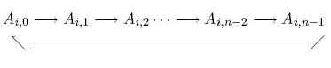

## Đề bài

Cho ma trận A kích thước nxn gồm các số nguyên, ( 0 ≤ i < n, 0 ≤ j < n ). Thao tác SHIFT tại hàng i ( 0 ≤ i < n ) sẽ dịch các số ở hàng i sang phải 1 vị trí và số ở cột cuối cùng sẽ trở về đầu tiên.



Bạn có thể thực hiện SHIFT bao nhiêu lần cũng được. 

Đặt ```Cj = A0,j + A1,j + ... + A(n-1),j``` và ```M = max {Cj|0 <= j < n }``` sau mỗi lần dịch chuyển. Cj là tổng các số ở cột j.

Tìm giá trị bé nhất của M.

### Đầu vào

Gồm một vài test, dòng đầu mỗi test là số nguyên n. n dòng tiếp theo mỗi dòng chứa n số  nguyên. Kết thúc các bộ test là số -1. Giả thiết là ```1 ≤ n ≤ 7``` và ```|Ai,j| < 10^4```.

Ví dụ:

```
2
4 6
3 7
3
1 2 3
4 5 6
7 8 9
-1
```

### Đầu ra

Với mỗi bộ test, in ra giá trị nhỏ nhất của giá trị lớn nhất của tổng các số trên 1 cột.

Ví dụ:

```
11
15
```

### Phân tích

Bài này thuộc chủ đề [Vét cạn - Brute force](/category/vet-can-brute-force/) nên đương nhiên sẽ phải dùng cách vét cạn. Tuy nhiên, vấn đề là nếu sử dụng thuật toán vét cạn thì độ phức tạp của nó là như thế nào, liệu có bị time limit hay không. Bây giờ, mình sẽ phân tích.

  * Bài toán cho SHIFT bao nhiêu lần cũng được, nhưng mình cần phải tính số lần SHIFT sao cho vét cạn được hết tất cả các trường hợp. Vì mỗi hàng của ma trận có n cột, nên ta có các trường hợp dịch với bước nhảy là: 0, 1, 2, ..., n - 1. **Chú ý rằng**: bước nhảy n sẽ giống với bước nhảy 0, bước nhảy n + 1 sẽ giống với bước nhảy 1,... Như vậy, mỗi hàng sẽ có n trường hợp dịch, mà ta có n hàng. Suy ra: tổng số trường hợp là ```n ^ n```.

  * Với mỗi trường hợp dịch như thế, ta phải tìm tổng giá trị của mỗi cột, sau đó suy ra giá trị lớn nhất giữa chúng (M). Và khi đã tìm ra mỗi giá trị lớn nhất này, ta chỉ cần so sánh nó với giá trị nhỏ nhất của M hiện tại để tìm ra giá trị bé nhất của M. Nghĩa là ta phải duyệt toàn bộ ma trận, do đó, độ phức tạp cho công việc này là: ```n ^ 2```.

  * Tổng hợp lại: độ phức tạp của thuật toán là: ```n ^ n x n ^ 2 = n ^ (n + 2)```.

  * Theo bài ra, giá trị lớn nhất của n là 7 => độ phức tạp = 7 ^ (7 + 2) = 7 ^ 9 = 40353607. Mà theo một nghiên cứu, khi độ phức tạp tính ra cỡ 10 ^ 9 thì thời gian thực thi mới hết khoảng 1 giây. Vì vậy, độ phức tạp mà mình tính ra như thế là hoàn toàn khả thi với ràng buộc của bài toán (time limit: 	0.131s-1.079s).

Mời bạn theo dõi cách triển khai của mình.

## Lời giải:

(Các bạn nên tự mình nghĩ ra thuật toán của bài toán trước khi tham khảo code của mình nhé. Hãy phát huy tối đa khả năng sáng tạo của bản thân. Hơn nữa code mình viết ra cũng chưa thật sự tối ưu. Nên rất mong nhận được sự chia sẻ của bạn.) 

`gist:completejavascript/7cd7f756baa37c452df0caaefc605eb4`

_Thân ái, Phạm Văn Lâm_


